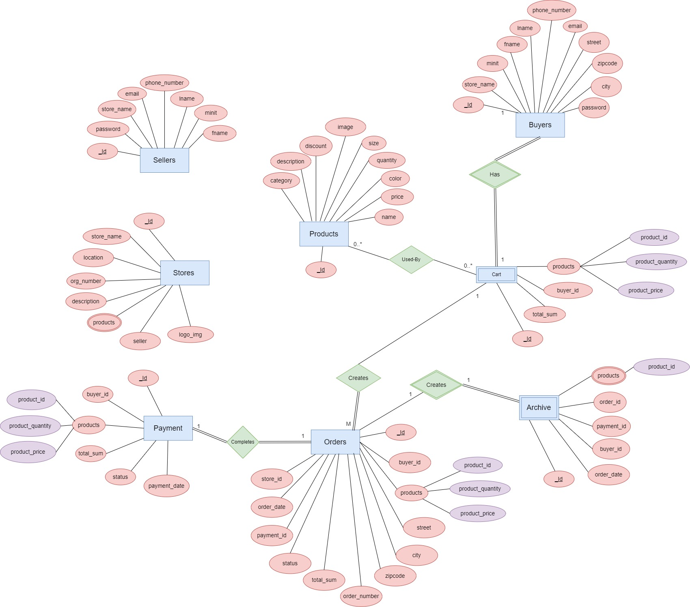
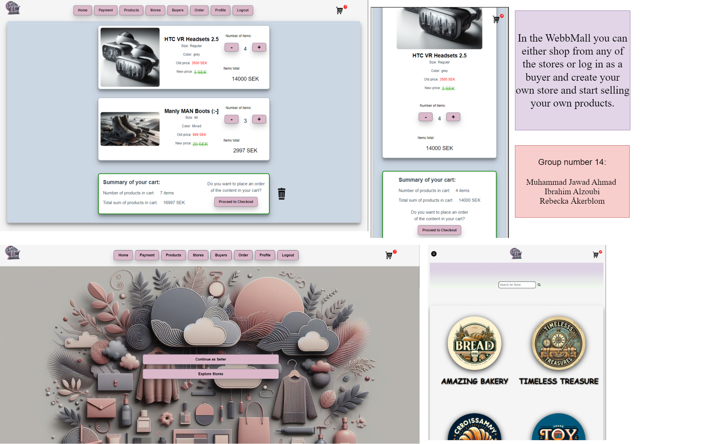

# Backend and Frontend Template

Latest version: https://git.chalmers.se/courses/dit342/group-00-web

This template refers to itself as `group-00-web`. In your project, use your group number in place of `00`.

## Project Structure

| File        | Purpose           | What you do?  |
| ------------- | ------------- | ----- |
| `server/` | Backend server code | All your server code |
| [server/README.md](server/README.md) | Everything about the server | **READ ME** carefully! |
| `client/` | Frontend client code | All your client code |
| [client/README.md](client/README.md) | Everything about the client | **READ ME** carefully! |
| [docs/LOCAL_DEPLOYMENT.md](docs/LOCAL_DEPLOYMENT.md) | Local production deployment | Deploy your app local in production mode |

## Requirements

The version numbers in brackets indicate the tested versions but feel free to use more recent versions.
You can also use alternative tools if you know how to configure them (e.g., Firefox instead of Chrome).

* [Git](https://git-scm.com/) (v2) => [installation instructions](https://www.atlassian.com/git/tutorials/install-git)
  * [Add your Git username and set your email](https://docs.gitlab.com/ce/gitlab-basics/start-using-git.html#add-your-git-username-and-set-your-email)
    * `git config --global user.name "YOUR_USERNAME"` => check `git config --global user.name`
    * `git config --global user.email "email@example.com"` => check `git config --global user.email`
  * > **Windows users**: We recommend to use the [Git Bash](https://www.atlassian.com/git/tutorials/git-bash) shell from your Git installation or the Bash shell from the [Windows Subsystem for Linux](https://docs.microsoft.com/en-us/windows/wsl/install-win10) to run all shell commands for this project.
* [Chalmers GitLab](https://git.chalmers.se/) => Login with your **Chalmers CID** choosing "Sign in with" **Chalmers Login**. (contact [support@chalmers.se](mailto:support@chalmers.se) if you don't have one)
  * DIT342 course group: https://git.chalmers.se/courses/dit342
  * [Setup SSH key with Gitlab](https://docs.gitlab.com/ee/ssh/)
    * Create an SSH key pair `ssh-keygen -t ed25519 -C "email@example.com"` (skip if you already have one)
    * Add your public SSH key to your Gitlab profile under https://git.chalmers.se/profile/keys
    * Make sure the email you use to commit is registered under https://git.chalmers.se/profile/emails
  * Checkout the [Backend-Frontend](https://git.chalmers.se/courses/dit342/group-00-web) template `git clone git@git.chalmers.se:courses/dit342/group-00-web.git`
* [Server Requirements](./server/README.md#Requirements)
* [Client Requirements](./client/README.md#Requirements)

## Getting started

```bash
# Clone repository
git clone git@git.chalmers.se:courses/dit342/group-00-web.git

# Change into the directory
cd group-00-web

# Setup backend
cd server && npm install
npm run dev

# Setup frontend
cd client && npm install
npm run serve
```

> Check out the detailed instructions for [backend](./server/README.md) and [frontend](./client/README.md).

## Visual Studio Code (VSCode)

Open the `server` and `client` in separate VSCode workspaces or open the combined [backend-frontend.code-workspace](./backend-frontend.code-workspace). Otherwise, workspace-specific settings don't work properly.

## System Definition (MS0)

### Purpose

Our platform, WebMall provides sellers with an easy-to-use solution for creating their own online stores. Sellers can sign up, customize their store/stores, and products listing, while WebMall handles the technical aspects like hosting, maintenance, with the potential to expand to processing payments, etc. 

Both sellers and buyers can create accounts, while the sellers' accounts are more complex, with the capability of adding and removing products, updating their information, etc.  

### Pages
(The user can log in as a buyer, a seller or as an admin. Different users will get access to different pages.) 

- Home Page: by accessing the website the end-user is presented with the following three options, which would lead to three different pages: 

- - Sign up/Sign in page 

- - WebMall Gallery 

- - WebMall Stores 

This page presents a grid view of best-selling products, best offers, hot and trendy products, etc. The buyer can navigate to the product page of any of the gallery products. 

- Sign up/Login: There are two variations of the signup page; one for sellers and one for buyers. However, the login page is one for both buyers, sellers and admin. The Login logic assigns different flags depending on the type of user. This changes the privileges that the user sees on the header.  
 


- WebMall Stores Page: 
This page presents a grid view of all the stores registered on the WebMall platform.  From there you can navigate to the Store Page of these stores to view their products. 
 


- Store Page:  
After choosing a certain store, this Store Page displays the products that this store has, as well as options of categories, and so on, to seamlessly find a specific item. Each product is displayed as a clickable card that leads to a Product Page containing product details. On this page the user has the option of adding the product to the cart.  
 


- Add-Product Page: 
A page where Sellers (store owners) fill in the product details. The seller clicks “Add” to save the product to the database and display it to the buyers on the store page.  
 

- Product Search Page (products display): 
Buyers on this page browse through a gallery of Mall or specific store products. Filters are implemented to allow for a more convenient user experience. 

 

- Single Product Page: Buyers can see all the information about the product and have a button to add the product to their cart. 
 

- Cart Page:  
On this page, the user is able to see all the products they added to the cart and their information. They can delete items and/or adjust the quantity of items they want to purchase. Users can also see the total sum of all items in the cart. The number of products in the cart is also displayed on the cart icon if the user is logged in and has products in the cart. If the user is logged in, and decides to log out the products will still be there the next time they log in.  
When the buyer is ready to buy the items, they can create an order.  

 

- Order History: A nested page inside the profile, where the buyer can see the orders they made and follow their status updates. The seller is responsible for updating the status. 
 

- Profile page:  
Buyers have profiles. There, the buyer can see his/her own personal information and update anything they want.  
 

- Inventory Manager:  
A page where the WebMall main Admin as well as registered sellers can see their own products and edit/delete or view these products.  
 

- Update product page:  
The Inventory Manager leads to this page where the user that has the necessary privileges can edit the product information.  
 

- Orders and Order Details pages:  
The Admin/Seller have access to a page where they can see all Orders they received. When clicking on the an individual order card, it leads to Order Details page where more information is displayed and the viewer has the option of deleting the order if necessary. 

### Entity-Relationship (ER) Diagram



## Teaser (MS3)



## Advanced Feature Proposal (MS3)

### **Payment API (Stripe API)**

Upon clicking Proceed to Checkout from the Cart, the Buyer is presented with a Payment Form. They will have to do the following:

* Enter credit card information

* Click confirm payment

When the Stripe API confirms the payment, it returns a String ID. Once the backend receives the backend ID it will do the following:

**Step 1:**

* Create Order

* (Store payment + store ID + product ID + total amount) in Payment Schema

* Update in the product schema the quantities of the products that were ordered

Step 2:

* information stored in the Payment Schema will be used to generate statistics for each individual store. These statistics can be for example, most sold product, total revenue.

* Generate a graph to visualise these statistics.

### **Frontend**:

payment page

show graph to store that shows how much they sold

### **Backend**:

Save the payment in the database (adding a new endpoint)

update the quantities of products that have already been sold 